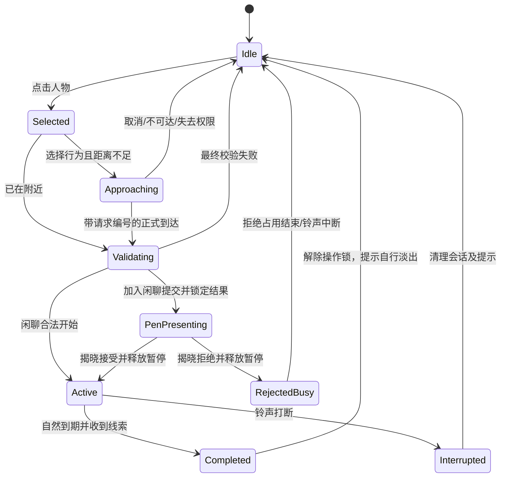

# 闲聊完整可玩流程计划案

> **For agentic workers:** REQUIRED SUB-SKILL: Use superpowers:executing-plans to implement this plan task-by-task. Steps use checkbox (`- [ ]`) syntax for tracking. 本次交付完整设计与实施计划，不实施代码、不自动提交。
>
> **落地状态（2026-10-08）**：Task 1–6 的实施项已按本文落地（内核服务 + 交互控制器 + 菜单／转笔 HUD／无字气泡／融合圈／四情绪 + 场景接线 + GUT 用例），逐项勾选见 §12。**仍未完成**：① 八张情绪图片与玩家立绘尚未收录（情绪先用文字呈现，§8.3 允许；情绪图片验收**未勾选**）；② 本机未做 1080p／720p 人工观感验收与「正常局里找得到发起／加入机会」的实操记录；③ 第四道门 `check_metrics.py` 的三项既有指标不达标（该门只跑 Python 参考内核，与本次改动无关，未改判据、未调数值）。

**Goal:** 在现有 3D 教室中跑通「点击人物 → 选择行为 → 检查距离和占用 → 走到附近 → 内核判定与结算 → 动画／气泡／底部圈／线索反馈 → 行为结束」，首批交付统一闲聊行为，包含发起新聊天与加入已有聊天两种参与方式。

**Architecture:** PlayerInteractionController 编排选择、接近和展示；PlayerController 独占玩家移动；SimCore 和行为组件执行校验、判定、关系结算及生命周期。真实 ActivitySessions 提供共同活动成员；聊天完成后由内核生成历史线索，表现组件通过统一反馈入口展示。

**Tech Stack:** Godot 4.7.2、GDScript、现有 Sprite3D 纸片人、CanvasLayer/Control、ActorWalker、AStarGrid2D、Tween、水平平面与 shader、GUT。不切换教室，不安装插件，不要求人物动作序列帧。

**Spec:** 玩法事实以 [主文档](../../gdd/core-gameplay-v3.1.md) §10.4–10.7、§10.31–10.32、§12 为准；本文 §1–11 是完整流程的设计建议，§12 是执行任务。用户明确要求先完善可玩性，数值后续统一调整。新增群聊编排及暂停接线属于待实施设计，不能把本文当作已经实现的状态。

**2026-10-07 修订（用户裁决）：** 闲聊与旧“搭话”合并为一个行为。玩家只选闲聊或使用通用加入操作；新请求始终 kind=chat，以 mode=start/join 区分是否加入原会话。旧 join_chat 配置、函数与统计字段暂作兼容实现，不删除、不调数值，不作为第二个产品行为。

## 1. 目标、边界与当前差距

玩家应能看清自己选择谁、为什么暂时不能聊、走到哪里、是否被接纳、正在和谁聊天、什么时候结束、最后获得了什么信息。无需编写具体聊天对白。

| 项目 | 当前代码事实 | 本轮需要做的事 |
|---|---|---|
| 场景 | `scenes/game/classroom3D.tscn`，3D 环境、Sprite3D 角色 | 直接接入当前场景，保留镜头与纸片人 |
| 玩家移动 | `scripts/game/player_controller.gd` 支持鼠标地面寻路、WASD、桌椅阻挡 | 增加人物拾取优先级、公开寻路与到达／取消信号 |
| 位置 | 内核已有 `set_position`、`position_of`、`distance_between` | 用真实 XZ 位置校验范围，并验证家具不隔开双方 |
| 闲聊 | `ChatBehavior` 已结算关系和占用；没有接受／拒绝掷骰 | 合法开始后进入双人会话，完成时给线索 |
| 加入闲聊 | `JoinChatBehavior` 有信念展示与真值判定；目前是双人执行 | 加入已有聊天会话，不能另开一场交互占用原成员 |
| 玩家入口 | `player_action` 校验相位、玩家占用和目标可用性 | 补空间校验、真实会话校验、幂等提交；保留入口兼容 |
| 活动圈 | `get_activity_circles()` 按行为名汇总，quiet 一方可能没有 current_act | 不能用来画融合圈；新增真实成员会话 |
| 完成 | `_settle_finished_actions()` 提供仅一 tick 有效的 `_last_finished` | 改为可靠的完成／中断通知与可查询结果，防止 UI 漏消息 |
| 时间 | `SimulationClock` 已有 hold/release/is_paused | 补全 NPC 移动、Walker 和玩家控制的暂停接线 |
| 反馈 | 已有圈、点击落点、四表情计划；八张表情实际路径未收录 | 复用设计，实施当前聊天所需部分，不扩展全部行为 |

本轮不做调侃、安慰等新入口，不做秘密／流言记忆／社会事件，不做全班 NPC 行走策略重写，不扩展 24 NPC 局，不实现完整存档系统。只有一种闲聊行为，发起与加入共用一条流程，不各写一套 UI 或移动系统。

## 2. 玩家实际看到的流程

### 2.1 点击与行为菜单

左键点击同学：只选中，不立即走动。人物头顶显示选中标记，屏幕底部小卡片显示名字、公开活动和一个随状态变化的聊天操作：空闲对象显示**闲聊**，已有聊天的成员显示通用**加入**操作，说明为「加入闲聊」。不同时列出两个聊天按钮，不再提供「搭话」菜单项。菜单不是把两个旧行为换名并排展示，而是同一 chat 的上下文操作。

| 目标状态 | 唯一聊天操作 | 参与方式 |
|---|---|---|
| 空闲且未睡眠 | 「闲聊」，远处提示「走过去闲聊」 | start：发起新聊天 |
| 正在真实聊天会话中 | 「加入」，说明「加入闲聊」，远处提示「走过去加入闲聊」 | join：加入原聊天 |
| 做其他占用型行为／睡觉／移动中 | 不提供聊天操作，显示具体公开原因 | 不可用 |
| 玩家忙碌、上课、简报或暂停 | 聊天操作禁用 | 不可用 |

“公开活动”只能来自当前行为／真实会话／睡眠与移动状态，不显示 NPC 压力、真实好感、敌对或信任。菜单不暂停全班，状态会随世界变化。

点击空白地面关闭菜单并按现有规则移动。点击 UI 由 Control 消费输入，不透传成地面点击。人物被桌椅遮挡时不能隔着家具选中；人物重叠时选择射线最近的可见人物。

### 2.2 发起新聊天（start）

1. 初次检查玩家权限、目标是否空闲，以及位置是否有效。
2. 已在交互范围且无遮挡：直接提交。否则显示「正在走向某同学」，寻路到合法的附近站位。
3. 到达后再次检查。通过则开始聊天；失败则停在到达位置、显示原因，不结算、不扣聊天占用。
4. 闲聊合法开始后直接进入聊天状态；**不显示虚假的成功率、不额外转笔、不追加接受／拒绝掷骰**。
5. 双人圈融合，双方显示无文字的聊天气泡，底部显示聊天进度。无需写“天气不错”等具体对白。
6. 自然完成时获得线索、显示玩家情绪反馈、拆分活动圈并解除占用。

“闲聊必得信息”指**已成功开始并自然完成**的闲聊。没走到、对方忙了、被铃声打断，都不属于完成闲聊。低透明度不使已完成聊天空手而归。

### 2.3 加入已有聊天（join）

1. 选中已有聊天会话中的一个成员，该成员是本次**应答者**。
2. 校验玩家空闲、会话有效且为公开 chat、成员没有睡眠，以及可达的近距离站位。
3. 选择时锁定 mode=join 和**原 session_id**，接近后再次校验。原聊天结束或成员换组时取消，不自动切换新聊天。
4. 取得本刻信念估计，暂停世界推进，内核原子地掷一次骰并结算，转笔播放已锁定结果。
5. 接受：玩家加入原会话，原组颜色与编号保持，区域扩展；开始共同聊天。
6. 拒绝：显示「没能加入聊天」，玩家圈不融合；原聊天继续，原组占用不被改短或延长。
7. 接受后自然完成共同聊天才给线索。拒绝不给线索；拒绝的占用结束后解除玩家操作锁。

发起与加入不是两种主行为。请求统一使用 kind="chat"，另用 mode="start"／"join" 区分参与方式。加入是 §10.31 的通用活动操作，本轮先落实闲聊的加入，不顺带增加其他活动入口。

## 3. 距离、路线与途中变化

### 3.1 统一空间判定

交互距离使用 `distance_between` 的真实地面位置，不能使用座位邻接表替代。建议新增 `data/rules/player_interaction.csv` 的 `chat_range_m=1.2`，这是首次交互几何参数的建议值；原好感、压力、概率、耗时参数保持不变。

闲聊双方距离必须不超过范围，双方脚下点合法，短连接段不穿过桌椅阻挡。加入聊天时玩家须能在**所有原成员**的交互范围内站稳，原组也须具有有效的近距离布局；不从教室另一头加入，也不画穿桌的连接带。

新增纯数据 `InteractionSpace` 保存障碍 Rect2 与房间边界，由场景从现有寻路几何导出并一次注入。内核只读坐标／矩形做范围与线段阻挡检查，不引用 Node3D、导航节点或相机。只有位置同步和几何注入完成后启用交互；初始化缺数据返回明确错误。

### 3.2 选择附近站位

复用 PlayerController 的 A*。在目标周围的范围内枚举合法格点，剔除人物占位、桌椅阻挡、无法满足共同成员范围和无路径的点，再选择**路径总长最短**的点；同长按格点坐标固定排序，不使用随机数。

前往人物的站位不能被“优先吸附到站立点”重新改到范围外，因此增加专用 `plan_approach()`，普通地面点击继续沿用原吸附规则。显示标记必须使用实际路径终点。

不能把 `ActorWalker.walk_finished` 当成成功到达：现有 stop() 同样发此信号。正式 PlayerController 必须区分 arrived、cancelled、failed，并带 request_id。

### 3.3 简单的途中策略

- 同时最多一个未提交请求；玩家无需排长队。
- 途中世界正常推进，不预占目标，不把目标提前冻结几十秒。
- 目标仍可自由行动；到达后失效就提示「对方位置／活动变了，请重新选择」。不自动无限追赶，不自动等待空闲，不自动反复掷骰。
- WASD、新地面点击、新人物选择或 Esc 取消尚未提交的接近请求；实际已经走过的时间不返还。
- 接近时标记玩家为“移动中”，NPC 不把移动中的玩家拉入新占用交互。到达／取消／失去权限时清理移动状态。
- 正式聊天中的人停止游走；结束后由原 Roam 重新决策，不恢复过期路径。
- 上课、日报或学期结束立即取消尚未提交的请求；已成立会话由内核给出完成或中断结果。

选择时冻结 preview 返回的 mode 和 session_id；到达时目标从空闲变为聊天，或原组结束变为空闲，都取消旧请求，不静默把 start 切成 join 或把 join 切成 start。暂停菜单冻结接近路径与请求，恢复后重新检查，不消费到达信号。选择按钮附近显示预计移动用时与聊天用时；剩余课间不足时提示「可能被铃声打断」，本版允许玩家尝试，不另加硬门槛。

## 4. 同一闲聊行为的两种参与方式：判定、结算与占用

### 4.1 沿用的数值

| 项目 | 唯一来源 | 本轮口径 |
|---|---|---|
| 闲聊耗时 | `data/rules/behaviors.csv` 的 chat.duration | 当前 30 tick |
| 加入闲聊拒绝耗时 | 同表 join_chat.duration | 当前 10 tick，只占玩家，不占用原组的新时段 |
| 加入闲聊成功后的聊天耗时 | 同表 chat.duration | 接受时至少给玩家一个完整聊天时段，按下文共享到期点 |
| 行走速度／碰撞／容差 | `data/rules/movement.csv` | 当前速度 0.13 m/tick，复用现有参数 |
| 关系与压力增量 | `data/balance/w_events.csv` | 沿用 topic_*、reject_* 的统一影响公式 |
| 加入闲聊概率 | 现有 `_join_probability`／`_join_feedback` 与阈值表 | 不改公式、门槛、尺度或性格权重 |

UI 将 tick 通过当前相位的时钟配置换算为实际等待秒数，不能把真实秒数与游戏内十分钟混为一谈，也不在产品界面显示实现字段。

### 4.2 闲聊的双人结算

继续复用 `ChatBehavior` 的事件顺序、观测与统计。关系效果仍在合法开始时执行一次，不等到动画结束再执行。自然完成只处理会话收尾与信息奖励，不把 topic_* 再应用一遍。

现有闲聊减压是发起者单方，本轮保留；“改为双方减压”会改变平衡，另行处理。闲聊不新增一次接受掷骰。

### 4.3 加入既有聊天：同一活动允许新增成员

`target_unavailable` 不能一概套到加入闲聊：普通行为仍拒绝忙碌目标；加入闲聊仅允许加入目标当前的**同一个有效 chat 会话**。目标忙于安慰、学习占用或另一个请求时仍拒绝。每人最多参加一个互斥活动会话。

判定只由选中的应答者执行一次，读其对玩家的真实好感及现有公式；屏幕估计读玩家对该应答者的信念。其他成员不各掷一次骰。

为了落实主文档“加入闲聊”，本轮采用以下群聊编排建议，事件系数不变：

- 接受后，玩家与每位原成员各建立一次新的聊天关系边：topic_affinity、topic_trust 按现有双向顺序执行，双方观测也按该新边执行；原成员之间的旧边不重算。
- topic_stress 只对玩家执行一次，保持“发起者单方减压”的现有口径；不因群聊人数增加重复减压。
- 接受后的统一结束点 `end_tick = max(原 end_tick, 当前 tick + chat.duration)`。将全体成员的占用和会话结束点对齐；不采用 `剩余时长 + 30`，不重复扣一段 join_chat.duration。
- 拒绝时 reject_affinity 对玩家→应答者执行一次，reject_stress 对玩家执行一次；reject_hostility 对玩家→各原成员分别执行一次，落实 §10.7 对原聊天成员的敌对反馈。原成员关系、剩余时间和圈不因拒绝重置。
- joins／join_accepts／join_rejects 每次加入请求记一次；chats 保持按新结算聊天关系对计数，原边不再记一次。表现层只收到一个加入结果，不因多条关系边弹多次反馈。

这是补齐群聊规则的**行为改动**，不声称与旧双人搭话实现的快照完全相同；需独立记录新增用例与基线。先交付“玩家加入已有组”，不同时重写 NPC 的自主加入闲聊候选算法。旧 NPC 行为路径保持原样，同时记录其已经成立的真实双人会话。

## 5. 内核会话、请求与生命周期

### 5.1 请求与会话是两个编号

`request_id` 标识玩家本次尝试；`session_id` 标识共同活动。一次加入闲聊成功会加入既有 session，不能用新 request_id 替换它。

ActivitySessions 沿用 [底部圈计划](2026-10-07-activity-foot-rings.md) 的 `begin/join/leave/end/expire/snapshot`，补 `session_of(member: int) -> int`、`extend(session_id: int, end_tick: int) -> void`。快照至少包含 `session_id,kind,members,links,end_tick`，不包含隐藏矩阵。新边只连接真正参与的成员；会话编号以计数器生成，不消耗随机数。

新双人闲聊建立会话；加入闲聊接受扩展原会话；拒绝不建立玩家会话。NPC 的 chat 与成功的旧 join_chat 同样在真实 chat 成立点登记一次，不从两条 event_happened 通知各建一次。

### 5.2 拟新增公开 API

| 归属 | 方法 | 契约 |
|---|---|---|
| SimCore | `preview_player_interaction(kind: String, target: int) -> Dictionary` | kind 统一为 chat；只读、零 RNG；根据目标状态返回 mode=start/join、eligible、in_range、reason、session_id、duration_ticks；仅 join 包含 p_belief |
| SimCore | `commit_player_interaction(request_id: int, kind: String, target: int, mode: String, session_id: int = -1) -> Dictionary` | 原子地再次校验并执行；返回 ok/error，成功提交包包含 request_id、kind=chat、mode、session_id、accepted、end_tick、展示估计和玩家自身效果摘要 |
| SimCore | `get_player_interaction(request_id: int) -> Dictionary` | 深拷贝查询 status=active/completed/interrupted 和 outcome=chat_started/join_accepted/join_rejected；拒绝也先 active 等占用到期，不能依赖仅一 tick 存在的 _last_finished |
| SimCore | `get_active_sessions() -> Array[Dictionary]` | 真正共同活动的深拷贝快照，供圈和加入查询 |
| SimCore | `get_player_intel() -> Array[Dictionary]` | 本局已获得的历史信息，深拷贝，不实时刷新旧值 |
| SimCore | `set_interaction_geometry(obstacles: Array[Rect2], bounds: Rect2) -> void` | 纯几何注入，不能保存场景节点引用 |
| SimCore | `set_moving(i: int, moving: bool) -> void` | 独立移动状态；不是聊天 busy，不让 PlayerController 因自己的移动状态停掉自己 |
| PlayerController | `plan_approach(targets: Array[Vector3], range_m: float) -> Dictionary` | 返回 ok/error、path、destination、length_m；零移动副作用 |
| PlayerController | `follow_path(request_id: int, path: PackedVector3Array) -> bool` | 开始已经确认的路径；拒绝返回 false |
| PlayerController | `cancel_request_movement(request_id: int, reason: StringName) -> void` | 只取消该请求，不能停掉后来新建的路径 |

提交失败：不掷骰、不改矩阵、不新增占用和会话。成功提交同 request_id 重复调用返回缓存结果；同编号改目标／行为／参与方式返回 request_conflict。请求计数器由本局内核分配，新增 `next_player_request_id() -> int`，仅生成编号、不掷骰；控制器重建时不得从零复用旧请求。

`player_action` 保留兼容入口：chat 先取得 start/join 预览并冻结参与方式，旧 join_chat 请求仅作为 chat＋mode=join 的兼容别名，均进入同一服务并使用内核分配的编号；不再向新 UI 暴露独立 join_chat 行为。不能保留可绕过距离与会话的旧远程入口；其他行为入口本轮保持原状。相应旧玩家测试应更新到真实空间夹具，不能靠兼容分支跳过规则。

### 5.3 通知与完成顺序

沿用 `event_sink → GameState.wire_events → EventBus.event_happened`，新增 payload.kind：`player_interaction_started`、`player_interaction_finished`、`player_interaction_interrupted`、`player_intel_received`；都带 request_id，涉及共同聊天再带 session_id。不替换单例或安装第二套事件总线。

自然完成的内核顺序固定：**认定到期 → 读取这一刻情报 → 写入本局日志 → 清理活动／占用 → 发布线索与完成通知 → 继续本 tick 的 NPC 决策**。同一结束点只完成一次，不能被后续自动行为覆盖后才取值。

相位切换的顺序：先把“已到期”的动作结为完成，再将“尚未到期”的跨段动作结为中断，再进入新段设置。尤其要覆盖完成时刻恰好等于铃声：完成不误算中断、不漏线索。不得只挂当前 _check_interrupt()，它会把到期记录清掉而不给 UI 完成信息。

聊天开始时登记“待完成信息”，自然完成消费一次；中断清除，拒绝从不登记。场景销毁不会撤销已经提交的结算；反馈组件重新绑定时从查询与历史日志恢复当前状态，不重新发奖。

## 6. 展示状态机与输入



Selected/Approaching 可取消。提交后的 PenPresenting、Active、RejectedBusy 禁止新行为和移动；Esc 正常打开暂停菜单，不能取消已提交结果。首版不提供提前结束聊天按钮。

Completed 不阻挡玩家继续行动，旧线索提示可以淡出；新请求开始时旧提示的 Tween 不能清掉新界面。所有回调先匹配 request_id，圈再匹配 session_id；所有新通知携带 kind=chat 和 mode，不让 UI 根据旧 join_chat 字段重新分成两个行为。

## 7. 转笔展示与世界暂停

只对闲聊的 join 模式接受判定显示转笔，start 模式合法后直接开始；合并菜单不代表给 start 新增拒绝掷骰。选择远处目标时可以看到估计，但提交时刷新为最新信念估计，不能拿行走前的数字当最终展示值。

在同一帧：复查控制权限 → 对齐场景位置 → `clock.hold(&"player_pen_check")` 并冻结世界移动 → commit 锁定结果 → 播放起势、旋转、收尾、揭晓。提交失败立即释放自己的 hold，不播放转笔。

一张透明笔 PNG 加程序旋转／缩放／淡残影即可。现有 `docs/art/ui_mockups/ui_pen_green_v01.png` 已确认是 2172×724 RGBA、具有透明区域；收录到 `assets/textures/ui/interaction/pen.png`，保持原图，用居中的 Control 作为旋转轴。

建议新增 `data/ui/chat_feedback_style.csv`：`pen_windup_seconds=0.15`、`pen_spin_seconds=0.65`、`pen_settle_seconds=0.20`、`pen_result_seconds=0.40`，合计约 1.4 秒。它们是可调整的呈现初值，不写回行为耗时。

- 文案：「我的把握 XX%」「根据目前了解估计」；结果是「加入了聊天」或「没能加入聊天」。
- 不展示真实概率、掷骰原值或 NPC 对玩家的真实关系增量；不能用信念概率再次判定。
- 跳过只提前揭晓同一个已锁定结果，不重复 commit、不缩短 10/30 tick 的真实占用。
- commit 已改变内核，但统一反馈入口缓存本请求的结果性通知；圈、气泡、声音和其他 UI 在揭晓前不得暴露 accepted。圈查询也必须按 request_id 隐藏这个未揭晓成员，原组继续可见。
- Clock.hold 并不会自动暂停独立 _process：Roam 不决策，所有 ActorWalker 不推进，PlayerController 检查 is_paused，世界动画计时停住；笔的 Tween 继续。
- 打开真正暂停菜单时笔的 Tween 也暂停；恢复后接着播放。退出场景、提交异常和跳过都必须清理自己持有的 hold，不能释放别的拥有者。
- 演出不推进 tick、不额外扣时间；原行为占用在恢复模拟后照常消耗。暂停与时钟累计秒数按现有时钟契约处理，不补演出期间的 tick。

## 8. 动画、气泡、底部圈和线索

### 8.1 聊天演出

双方停止行走，纸片人只按现有水平翻转朝向，不额外旋转 billboard 平面。各自头顶一个无字气泡，三点依次淡入淡出；底部显示「正在和某同学聊天」与剩余用时。群聊使用同一会话进度，不给每条关系边生成进度条。

不叠加步行 bob，不播放明显晃动或跳跃。结束后清理三点气泡；名字牌与表情气泡使用不同锚点／上下间距。

### 8.2 底部圈

复用 [人物底部活动圈计划](2026-10-07-activity-foot-rings.md)：所有个人圈同色；聊天成立变为活动异色；两人圆与连接胶囊绘成同一连续区域，无内部双边框。加入闲聊接受扩展原组，拒绝不融合；不同会话不会因为同为 chat 而融合。

本轮实现个人圈、双人聊天和玩家加入后的多人成员更新，不顺带实现全部活动类型。会话结束／中断恢复个人圈。颜色表示一起活动，不表示永久友情；拒绝不生成持续的“敌对红圈”。

已有 NPC 关系结算仍可能远程发生；记录事实不等于可以画长桥。远程组保持个人圈、不提供可加入按钮，并输出开发诊断。本轮不伪造 NPC 自动接近，也不承诺补齐全班空间 AI；正常游玩中的近距离可加入聊天必须另作场景验收。

### 8.3 玩家四种情绪

复用 [点击与情绪反馈计划](2026-10-07-player-click-emotion-feedback.md) 的 relaxed/angry/crying/happy 男女八图与映射器。只展示玩家自身已发生事件的效果，不扫 NPC 内心。

聊天自然完成后根据本次已结算的玩家自身效果摘要、玩家当前压力和性格选择一次表情。拒绝在拒绝占用结束时给一次负面反馈；铃声中断按实际中断效果给一次反馈，不再弹自然完成气泡。

气泡的所有男女差别只在外观，男女不能改变判定。八图没有实际资源路径时，**情绪图片验收不得勾选完成**；阶段开发可用公开文字结果和无字聊天气泡继续联调，不凭空填路径。不得因为情绪图片未收录阻止核心流程启动。

### 8.4 完成闲聊的线索

数量沿用主文档 §10.5：闲聊对象完成时 O < 50 给一条，O ≥ 50 给两条；每条只透露好感／敌对／信任中的一个轴，不展示整组三轴。该数量口径不是本轮调参。

原目标／应答者是 source；subject 从本局其他 NPC 中选，排除玩家与 source；两条时 subject 不重复。source→subject 的方向必须明确。例如「某同学在刚才的聊天中透露：他对另一同学的敌对是 68」，不能写成反方向关系。

内核读取**自然完成这一刻**的真实 `affinity(source,subject)`／`hostility`／`trust`，只拷贝被抽中的轴。线索字段：

`clue_id,request_id,session_id,source,subject,axis,value,day,phase_id,global_tick`。

界面显示来源、对象、单轴值、获知时间与「记录于当时，关系可能变化」。历史卡片不跟着矩阵实时刷新，不预设虚构对白，不把真值写回 B_A/B_H/B_T（当前信念结构也无法存任意第三人的关系）。自然完成事件同 clue_id 去重。

线索抽样使用**独立、有种子的 RandomNumberGenerator 实例**，seed 取本局 seed，候选与轴按稳定顺序建立；只在真正完成且发奖一次时使用。它不消费现有内核主随机流；显示／隐藏 UI、跳过动画、改变帧率不会改变抽样。完整存档未来必须保存该流状态与历史日志，本轮不宣称已经支持存档恢复。

玩家加入聊天时也会明确收到这一会话完成后的线索，source 固定为本次应答者，而不是临时随机换人。拒绝／未提交取消／中断不给完成线索。

## 9. 组件、文件与接线

| 文件 | 责任／本轮改动 |
|---|---|
| 新增 `scripts/core/activity_sessions.gd` | 真实共同活动记录器，沿用原圈计划接口 |
| 新增 `scripts/core/interaction_space.gd` | 纯几何与位置有效性检查，无场景引用 |
| 新增 `scripts/core/player_interactions.gd` | 校验、幂等提交、请求状态与完成／中断；弱引用内核，不复制矩阵 |
| 新增 `scripts/core/player_chat_intel.gd` | 单轴信息抽样、独立 seeded RNG、历史记录与去重 |
| 修改 `scripts/core/sim_core.gd` | 持有上述服务、公开 API 转发、完成与段切换挂点，不再堆一套 UI 流程 |
| 修改 `scripts/systems/behaviors/{chat,join_chat}_behavior.gd`、`behavior_context.gd` | 真实会话成立挂点、玩家加入同组编排、共享统一结算服务；保留 NPC 旧路径 |
| 修改 `scripts/game/player_controller.gd` | 人物拾取优先、专用接近路径、request_id 到达／取消、暂停和移动状态 |
| 修改 `scripts/game/classroom_actors.gd` | 显式 actor_index 元数据、`actor_for(i: int) -> Node3D`、人物拾取体与反馈锚点 |
| 新增 `scripts/game/player_interaction_controller.gd`、`scenes/game/player_interaction_controller.tscn` | 选择／接近／展示状态机，消费输入，连接所有组件 |
| 新增 `scripts/ui/player_interaction_menu.gd`、`scenes/ui/player_interaction_menu.tscn` | 名字、公开活动、同一聊天的上下文操作、不可用原因 |
| 新增 `scripts/ui/chat_feedback_hud.gd`、`scenes/ui/chat_feedback_hud.tscn` | 统一结果通知入口、转笔、进度、线索提示与本局历史列表 |
| 新增 `scripts/ui/chat_activity_bubble.gd`、`scenes/ui/chat_activity_bubble.tscn` | 投影到屏幕的无字聊天气泡，只读会话；暂停计时 |
| 复用原计划 `activity_ring_presenter`／`activity_ring.gdshader`、`emotion_bubble`／`player_emotion_feedback` | 每项只实施聊天所需部分，不再复制另一套脚底圈或四表情映射 |
| 修改 `scripts/game/classroom_roam.gd`、`actor_walker.gd` | 世界 hold 冻结移动；会话成员不游走；结束后重新决策 |
| 修改 `scripts/game/classroom.gd`、`scenes/game/classroom3D.tscn` | 一处初始化和绑定，不替换时间 HUD 或重复绑定 Clock |
| 修改 `autoload/game_state.gd` | 保持既有 event_happened 路由；新 kind 走同一路由，必要时更新注释 |
| 新增 `data/rules/player_interaction.csv`、`data/ui/chat_feedback_style.csv` | 交互几何、菜单／转笔／气泡呈现参数；不修改旧平衡表 |

人物拾取采用 Area3D + CollisionShape3D，索引放元数据。由交互控制器在现有地面点击之前做统一射线查询，消费人物输入；不能依赖 Area3D.input_event 后到的回调，让玩家先向地面走了一步。新增配置建议 `actor_pick_layer=2`、`world_pick_blocker_layer=1`（位掩码），查询最近命中；人物拾取体以实际立绘尺寸派生。当前桌椅绕行靠矩形，不代表已经有可射线命中的物理体，因此 Task 3 同时检查并从桌面／墙的实际 Mesh 派生必要的静态遮挡体，不手填另一套家具坐标。碰撞层有现存用途时先核对再分配，配置与用例一并更新。读取实际 Raycast 命中，不自行假设屏幕矩形里的所有人物可见。

Controller 的 auto 只在选择时解析参与方式；一旦开始接近，提交必须使用已冻结的显式 mode。Controller 公共接口：`bind_sources(core: Variant, player: PlayerController, actors: Node3D, clock: SimulationClock) -> void`、`select_actor(index: int) -> void`、`request_behavior(kind: String, mode: String = "auto") -> void`、`cancel_pending(reason: StringName) -> void`、`state_snapshot() -> Dictionary`。HUD 接口：`present_locked_result(packet: Dictionary) -> void`、`show_active(packet: Dictionary) -> void`、`show_intel(clues: Array[Dictionary]) -> void`、`clear() -> void`；揭晓信号 `result_revealed(request_id: int)` 负责放行缓存结果并释放本组件 hold。

统一绑定顺序：人物与几何准备 → 位置写回 → Clock 绑定 → Player/Roam 绑定 → 交互控制器、HUD、圈、气泡绑定。场景退出逐一断开信号，取消未提交请求、停止 Tween、释放自己持有的暂停；不撤销已提交结算。

ConfigLoader 已递归加载 data 下的 CSV，无需增加虚构“表注册列表”；要补新表消费者校验、`data/README.md` 与 `tools/check_config.py` 的类型／范围／必须键检查。

## 10. 素材与开发阶段验收

| 素材 | 来源 | 是否需要新增绘制 |
|---|---|---|
| NPC 立绘 | 当前 appearance.csv 对应 Sprite3D | 不要求新动作帧 |
| 玩家立绘 | 当前玩家仍是占位 Marker | 收录明确选择的外观映射，禁止按名字猜；功能联调可用 Marker，展示版必须换立绘 |
| 转笔 | 已有透明笔 PNG，路径见 §7 | 不需重新生成，程序动画 |
| 无字聊天气泡 | 统一底板、三个程序点 | 纯程序可完成 |
| 点击落点 | `assets/textures/ui/movement/click_destination_v01.png` | 已有，可复用；不能和融合圈混用 |
| 单人／融合圈 | 平面与 shader | 纯程序完成 |
| 男女四情绪 | 用户已有八图，实际路径未收录 | 不重画；收录实际文件并校验映射 |
| 菜单／进度／线索卡 | 与 TimeHUD 同一浅纸色、深绿边框和字体系统 | Control/样式完成；不增加写实大头像素材 |
| 音效 | 可后续接入 | 首次可玩闭环不依赖音效 |

菜单与进度保持轻量，聊天时仍能看到两人及脚底圈。转笔卡片只在判定期间出现，不长期遮住下半间教室。1080p、720p 与缩放窗口检查文本不溢出、头顶气泡不叠名字、笔旋转不出卡片。

“逻辑闭环完成”与“八张情绪图片／玩家立绘完整展示”分开验收，缺图必须明确记录，不能宣称全部表现已完成。

## 11. Global Constraints 与 Review Focus

**Global Constraints**

- 保持当前 16 NPC＋玩家、现有 3D 教室及鼠标/WASD 移动；内核无 UI／场景引用。
- 行为不判断角色名字或特定 ID；性别只选择图片。矩阵修改仅经原统一结算服务。
- 不修改现有 behavior_probs、behavior_thresholds、w_events、axis_coef、movement 数值或指标判据；新增几何／呈现参数集中于 data。
- 只读预览不消耗任何玩法 RNG；一次合法加入闲聊只有一次接受判定；信息流与主随机流分开。
- 完成、中断、拒绝、未提交取消各有独立状态；无双发线索、无双结算、无“忙碌归零就算完成”。
- 圈只依赖真实同一会话，未揭晓结果不得从任意反馈通道泄露。
- 不手改 .godot/、resources/*.tres，不为输入增加未经需要的全局单例。
- Python 暂保留离线标定参考；本轮玩家 UI／线索不向 Python 复制。新增玩家群聊逻辑先以 GDScript 用例验收；涉及共同 NPC 规则的改动另做双端同步，不把旧跨语言全局均值验证当新玩家流程的证明。

**Review Focus**

1. 点击纸片人先被地面移动消费，或被家具挡住的角色仍可选中（任务 3、4）。
2. 旧到达／Tween 回调把新的请求提交、取消或清屏（任务 3、4）。
3. 原组结束／换组后仍加入闲聊，或拒绝篡改原组占用（任务 2）。
4. 最后一 tick 完成遇铃声、低帧率多 tick 漏完成、重绑界面重复发奖（任务 1、5）。
5. 主时钟暂停但 NPC 仍走、融合圈提前泄露结果、退出留下 hold（任务 4、6）。

## 12. 实施任务与验收

按依赖顺序实施；每项先写能证明行为契约的 GUT 用例，再做最小实现。任务是建议提交边界，实际 git commit 按用户指令执行，不自动提交。

### Task 1：真实会话与可靠结束事件

> **2026-10-08 勾选口径**：以上「先写失败用例」的条目按**实质**勾选 —— 用例与实现同时落地，用例证明的是契约本身（见 `tests/unit/` 与 `tests/integration/`），不是严格的测试先行顺序。未勾选的三条：情绪八图与玩家立绘未收录（情绪暂用文字呈现）、1080p／720p 人工观感与「正常局里找得到机会」的实操记录未做。

**Files:** 创建 `scripts/core/activity_sessions.gd`、`tests/unit/test_activity_sessions.gd`；修改 SimCore、ChatBehavior、BehaviorContext 与 `tests/unit/test_action_completion.gd`。

**Interfaces:** 产出 §5.1 会话方法、`get_active_sessions()` 和完成／中断通知；不包含玩家 UI。

- [x] 写失败用例：两对同为 chat 的人有两个不同 session；quiet 成员仍在正确会话；重复 chat/join 通知不重复创建。
- [x] 写用例：同一人不能在两个互斥会话中；extend 不缩短结束点；深拷贝快照不污染内部数据。
- [x] 写用例：到期与中断互斥；最后一 tick 到期后切段仍完成；尚未到期切段清会话、busy_act/current_act，不残留圈。
- [x] 用 GUT 单跑上述文件确认实现缺失导致失败，再实现真实 chat 成立点记录及完成顺序。
- [x] 验证无玩家输入的原 NPC 行为、矩阵、统计、主 RNG 与旧基线一致；会话登记不额外掷骰。

### Task 2：空间权限、原子提交与玩家加入

**Files:** 创建 `interaction_space.gd`、`player_interactions.gd`、`data/rules/player_interaction.csv`、`tests/unit/test_player_interactions.gd`；修改 SimCore、JoinChatBehavior、BehaviorContext、现有玩家入口测试、配置校验与 data 文档。

**Interfaces:** 消费 Task 1 会话；产出 §5.2 预览、请求编号、提交、状态查询、几何与移动状态 API。

- [x] 写失败用例：远程、隔桌、睡眠、移动、玩家占用、上课拒绝；预览零 RNG、零矩阵与占用变化。
- [x] 写用例：忙碌但在目标 chat 原会话可加入；忙于其他事不可；会话换号后旧请求失效；start/join 状态变化拒绝旧请求，不能由调用方伪造 mode 绕过会话校验。
- [x] 写用例：信念概率与真值概率故意不同；一次提交只取一个判定 roll；重复提交结果、矩阵、统计、主 RNG 完全不变。
- [x] 写用例：接受时新边结算一次、原边零次、玩家减压一次、全组 end_tick 取 max；拒绝只占玩家 10 tick，原组 end_tick 和成员不变。
- [x] 实现新服务与组件分支；旧 player_action 的两种聊天入口转入同一服务，不能远程绕过。
- [x] 配置校验检查几何参数为正、必需键齐全；运行新测试与旧玩家权限／行为组件测试。

### Task 3：人物拾取与正式接近路线

**Files:** 修改 PlayerController、ClassroomActors；扩充 `tests/unit/test_player_controller.gd`，新增 `tests/unit/test_player_approach.gd`。

**Interfaces:** 消费 Task 2 几何／移动状态；产出 `actor_for`、`plan_approach`、`follow_path`、`cancel_request_movement`；信号 `request_arrived(request_id: int)`、`request_cancelled(request_id: int, reason: StringName)`、`request_failed(request_id: int, reason: StringName)`。

- [x] 写失败用例：专用接近终点在全体目标范围内、绕开桌椅、使用路径末端；原吸附不把终点推到范围外。
- [x] 写用例：路径不可达返回失败；重复 stop 不产生 arrived；已在范围内无需走动。
- [x] 写用例：旧 request 的到达／取消不影响新路径；WASD、新地面点击取消接近；hold 暂停后恢复重查。
- [x] 实现显式人物索引、拾取体与锚点、家具拾取遮挡体、公共路径 API；保持普通地面移动行为。
- [x] 在集成测试证明 UI 点击不走、人物点击不走、遮挡人物不选；移动状态正确写回、所有取消路径清理状态。

### Task 4：菜单、交互状态机、转笔与世界暂停

**Files:** 创建 §9 Controller/Menu/HUD 脚本与场景、`data/ui/chat_feedback_style.csv`、`tests/unit/test_player_interaction_controller.gd`；修改 Classroom/Roam/Walker 和教室场景；复制已有笔资源至正式 assets 路径。

**Interfaces:** 消费 Task 2–3 API；产出 §9 Controller/HUD API、`result_revealed(request_id)` 和结果缓存；给后续反馈组件同一个揭晓许可。

- [x] 写失败用例：空闲目标显示「闲聊」、chat 成员显示「加入」且说明「加入闲聊」，两者均提交 kind=chat，并分别锁定 start/join；菜单没有搭话或独立 join_chat；到达后再次检查目标和原 session。
- [x] 写用例：只有加入闲聊转笔；刷新提交时信念显示；跳过后 accepted 不变且无第二次结算；拒绝后玩家等待占用结束。
- [x] 写用例：世界 hold 下 Clock 不推进、Roam 不决策、Walker 不移动、玩家不可控；笔照常转；真正暂停菜单让笔停下。
- [x] 写用例：旧 Tween 不能释放新请求的暂停；提交失败、退出场景各释放自己的 hold，其他拥有者仍保持暂停。
- [x] 实现统一闲聊状态机及 start/join 分支、菜单禁用原因和统一反馈缓存，接入教室；手动确认转笔没有遮住人物。

### Task 5：自然完成线索与历史列表

**Files:** 创建 `scripts/core/player_chat_intel.gd`、`tests/unit/test_player_chat_intel.gd`；修改 PlayerInteractions/SimCore/HUD、主文档和架构相关描述。

**Interfaces:** 消费 Task 1 完成挂点、Task 2 请求状态；产出 `get_player_intel()`、§8.4 线索字段和 `player_intel_received` 通知。

- [x] 写失败用例：合法聊天开始时无奖励；30 tick 自然完成只奖一次；拒绝／取消／未完成中断没有线索。
- [x] 写用例：O=49 一条、O=50 两条；每条仅一个轴，排除玩家／source；两条 subject 不重复；方向为 source→subject。
- [x] 写用例：开始与完成期间真值发生变化，线索取完成时值；完成后矩阵再变，旧记录不变；记录不回写信念或真实矩阵。
- [x] 写用例：一帧推进多个 tick 不漏奖励，重绑 HUD 不重发；同 seed／同完成输入线索可复现，主 RNG 不因线索生成改变。
- [x] 实现独立有种子信息流、内核历史日志、即时提示与可展开历史列表；完成时 effect 摘要只供本次玩家情绪使用。
- [x] 核对贴近铃声的完成顺序，避免段首清理吞掉奖励；补实现后的文档与 CHANGELOG。

### Task 6：气泡、融合圈、情绪与全流程验收

**Files:** 按 §9 创建 ChatActivityBubble 及原两份反馈计划中的聊天子集；创建 `tests/integration/test_player_chat_scene.gd`，补圈／气泡／情绪针对性测试。

**Interfaces:** 消费统一揭晓许可、真实会话、正式人物锚点与线索通知；所有表现只读。

- [x] 写失败用例：双人融合、加入后沿用原色、两组 chat 分开、不合并旁观者；完成／中断恢复个人圈。
- [x] 写用例：commit 已接受但未揭晓仍是个人圈／无结果气泡；揭晓后才扩圈；拒绝不创建融合会话。
- [x] 写用例：聊天三点与人物锚点正确跟随；姓名和表情不重叠；低帧率、暂停、缺图、切场景都不残留气泡。
- [ ] 实施无字气泡、聊天进度、SDF 融合圈；收录八张情绪实际映射并按本次自身效果选择一个表情，完成通知去重。
- [x] 用真实 scene 运行三条集成用例：近距离直接闲聊；远处绕桌接近后闲聊；已有近距离 NPC 双人会话中玩家加入闲聊接受／拒绝。受控种子／夹具仅用于测试，不写进正式关卡剧情。
- [ ] 手动从新游戏体验三段课间与铃声、跨天简报继续；额外记录正常局可找到的发起聊天／加入聊天机会。若全班空间 AI 或当前密度让机会不足，如实列出问题，不暗调概率或伪造聊天组。
- [x] 验证全部 GUT、配置／文档检查；执行规定六道门并保留实际失败报告，既有数值不达标不能改判据伪装通过。
- [ ] 归档 1080p／720p 截图和功能验收，区别“逻辑通过”与“素材完整”。

## 13. 验证命令与交付标准

Godot 不在 PATH 时用 `tools/README.md` 配置的完整可执行路径替换以下 godot；PowerShell 用 `& "完整路径"` 调用。

```bash
# 每项先单跑对应文件，再跑整个 unit 与新增场景集成用例
godot --headless --path . -s addons/gut/gut_cmdln.gd -gtest=res://tests/unit/test_player_interactions.gd -gexit
godot --headless --path . -s addons/gut/gut_cmdln.gd -gdir=res://tests/unit -gexit
godot --headless --path . -s addons/gut/gut_cmdln.gd -gtest=res://tests/integration/test_player_chat_scene.gd -gexit

# 执行阶段的提交前检查；&& 在 PowerShell 7 或 bash 使用
python tools/check_config.py && python tools/test_core.py && python tools/verify_formula.py && python tools/check_metrics.py && python tools/diversity_report.py && python tools/check_docs.py
```

新功能不以“六道门全部已经通过”作为本文前提。六道门遇失败会停止，后续门另行运行并记录；不改当前指标区间，不使用 SKIP 作为真实跨语言对拍成功。只修改 GDScript 玩家专属功能时，不要求 Python 复制 UI 流程；共同 NPC 规则若变更必须另列对应验证。

首批交付需要同时满足：人物选择无误触；只有一个闲聊行为，发起／加入参与方式清楚；到达前没有关系结算；距离与占用最终校验无法绕过；判定一次且不提前泄露；真实会话有开始和结束；自然完成必有正确时间的线索；铃声中断不发完成线索；正常游玩中确实有近距离操作机会。八图和玩家立绘未收录时，表现完整项仍未完成。

推荐执行次序：**真实会话 → 空间与提交 → 人物接近 → 菜单与转笔 → 完成线索 → 三类反馈与场景验收**。之后其他行为复用选择／接近／提交／反馈协议，不重新搭一个玩家控制系统。
